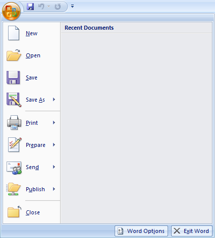
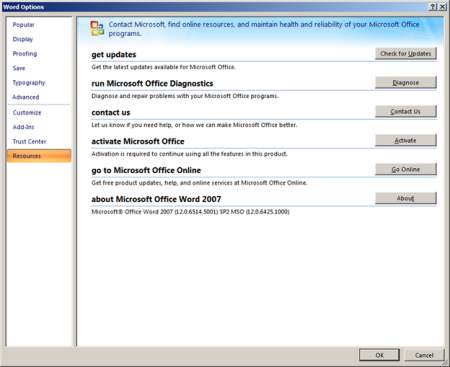
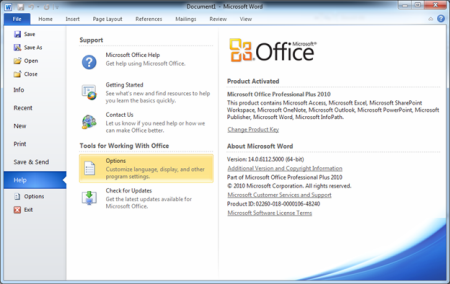
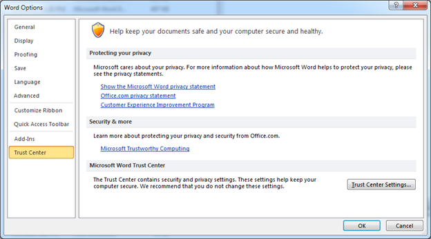
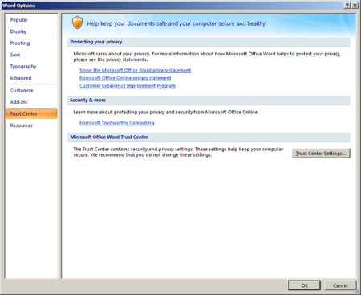
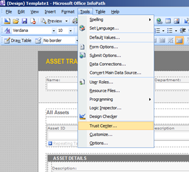
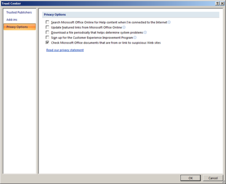
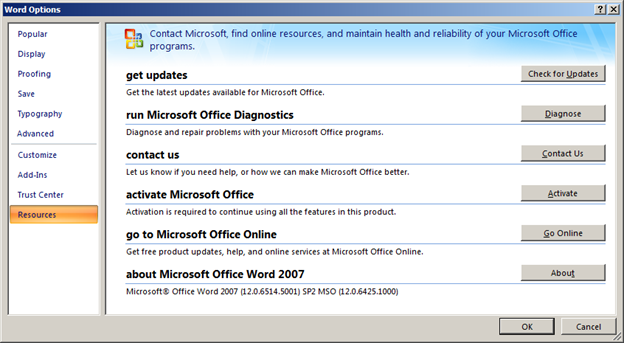

# Frequently asked questions about the Office Activation Wizard

## Introduction

This article contains some of the most frequently asked questions about the Microsoft Office Activation Wizard.This article only pertains to Retail versions of Office 2010 suite or program.

**Note** Activation is now required for Office 2010 Volume License suites and programs. For further information on Volume License activation in Office, see [Volume activation of Office 2013](https://docs.microsoft.com/previous-versions/office/office-2013-resource-kit/ee705504(v=office.15)?redirectedfrom=MSDN).

Microsoft Office 2010 and the Microsoft 2007 Office system include an Activation Wizard. To fully use a retail version of an Office 2010 suite or program or an 2007 Office system suite or program, you must activate it. If you do not activate the product after you install it, the Office 2010 programs and the 2007 Office system programs can be started only in reduced-functionality mode. In reduced-functionality mode, Office 2010 programs and 2007 Office system programs function more like viewers. In other words, you cannot save changes to documents or create new documents. Additional functionality may be reduced. No existing Office 2010 files or 2007 Office system files are damaged when a product runs in reduced-functionality mode.

## More Information

Q1: What is product activation?

A1: Microsoft asks that you activate your product to make sure that your installation is performed with a genuine Microsoft product. Product activation is an anti-piracy technology that is designed to make sure that the product is legitimately licensed. When you activate a product, no personal information is sent to Microsoft.

Q2: Who must activate their retail copy of an Office 2010 suite or program?

A2: Product activation is required for all licenses that are purchased through retail distribution. If you purchased a new computer from a computer manufacturer, you may have to activate the Microsoft software that is installed on the computer. However, some computer manufacturers may activate the Microsoft software in the factory.

Q3: How does product activation work?

A3: Product activation checks that the product key has not been used on more personal computers than are permitted by the Microsoft Software License Terms. You can activate your product either over the Internet or by telephone. If you activate a product by telephone, you provide an installation ID code. In return, you receive a confirmation ID number. A Microsoft customer service representative activates the product by telephone. This process takes several minutes. If you want to activate your product over the Internet, the process is performed automatically. The only information that you must provide is the name of your country and your region.

**Note** If you are activating the Product Trial Program version, you can activate the product only over the Internet.

Q4: How do I activate my product?

A4: You can access the Office 2010 Activation Wizard in two ways: 

- The Office 2010 Activation Wizard appears when you start an Office program that has not been activated.   
- On the **File** menu, click Help, and look for the section under the Microsoft Office logo. If "Product is not activated" text appears, click Change.   

You can access the 2007 Office system Activation Wizard in two ways: 

- The 2007 Office system Activation Wizard appears when you start an Office program that has not been activated.   
- Click the **Microsoft Office Button**, click **Program_Name Options**, click
**Resources**, and then click **Activate**.

   

Q5: What happens during product activation?

A5: During product activation, the Office Activation Wizard creates a hardware identification that represents the configuration of your computer at the time of activation. This hardware identification is not unique. It does not include any personal information, any information about software or data that may reside on your computer, or any information about the specific make or model of your computer. The hardware identification identifies only the computer. Additionally, the computer identification is used only for activation.

During product activation, you may also provide your personal contact information if you want to register the product with Microsoft. 

The Office Activation Wizard can detect and tolerate changes to the configuration of your computer. Minor hardware upgrades do not require reactivation, but if you make major changes to the computer over time, you may have to reactivate the product.

Q6: How does product activation protect customer privacy?

A6: Microsoft highly values respecting and protecting customers' private information. If you do not register the product, none of the information that is collected during product activation will be used to personally identify you.

To view the Microsoft privacy policy, use one of the following methods. 

Office 2010 programs

1. Start the Office 2010 program.   
2. On the File menu, click **Help**.

      
3. Under the Tools for Working with Office heading, click Options.   
4. In the navigation pane, click Trust Center.

      
5. Click the "Show the Microsoft programprivacy statement" link.   

In Access 2007, Excel 2007, PowerPoint 2007, and Word 2007

1. Start the 2007 Office system program.   
2. Click the **Microsoft Office Button**, and then click **Program_Name Options**.

   
3. Click **Trust Center** in the navigation pane, and then click one of the following: 

   - **Show the Microsoft Application privacy statement**   
   - **Microsoft Office Online privacy statement**   

   

All other 2007 Office system programs

1. Start the 2007 Office system program.   
2. On the **Tools** menu, click **Trust Center**.

      
3. Click **Privacy Options** in the navigation pane, and then click **Read our privacy statement**.

      

Q7: Is product activation the same as registration?

A7: No. Product activation differs from product registration. You can voluntarily register your product by providing your name and contact information during product activation. Register the product if you want to receive future communications about product updates, service releases, and special offers. 

Q8: How do I know whether my product is activated?

A8: The Office Activation Wizard does not run if you already activated your product. If the product was already activated, you receive the following message when you run the Office Activation Wizard: The product has already been activated. 

In Office 2010, you can check the activation status by clicking Help on the File menu. On the right side of the dialog box, under the Microsoft Office logo,you see a message that says "Product activated" or "Product requires activation."

Q9: Does the product stop working if I do not activate it?

A9: No. When the full functionality of the program and the number of program starts are exhausted, the product runs in reduced-functionality mode.

Q10: What is reduced-functionality mode?

A10: In reduced-functionality mode, programs function similarly to viewers. When a program runs in reduced-functionality mode, many commands are unavailable (dimmed). Therefore, you cannot access those functionalities. Some limitations of reduced-functionality mode include the following: 

- You cannot create new documents.   
- You can view existing documents, but you cannot edit them.   
- You can print documents, but you cannot save them.   
 
No existing Office files are damaged. Additionally, you can easily stop Office from running in reduced-functionality mode. To do this, follow the instructions on the screens that appear. 

Q11: How do I update information that relates to product activation?

A11: To make sure that the information that you provide to Microsoft in the Office Activation Wizard is correct, you can contact Microsoft any time to review and update the information. In some Office products, you can use the Office Activation Wizard to update your information over the Internet or by telephone. If these options are unavailable to you, you can update or change any information that you provided. To do this, send your product ID and a description of the changes that you want made to the following address: 

Microsoft 

Attn: Microsoft Product Activation 

One Microsoft Way 

Redmond, Washington 98052-6399

Microsoft will update your information to reflect any changes that you want made. You must provide your product ID so that Microsoft can accurately identify your activation record.

Note To find the product ID, click **About Program_Name** on the **Help** menu in an Office program. In Access 2007, Excel 2007, PowerPoint 2007, and Word 2007, follow these steps:

1. Click the **Office Button**, and then click the **Program_Name Options** button.

      
2. Click the **Resources** option in the navigation pane, and then click the **About** button beside the **about Microsoft Office Program_Name 2007** label.

      

Q12: Why do I receive notifications to activate my product?

A12: If you do not activate an Office product, you receive a reminder to activate your product every time that you start the program.

The reminder helps make sure that you are aware that license activation is required and that you can complete the product activation process before the program enters reduced-functionality mode.

Q13: Is there more than one kind of product license?

A13: Yes, the following license types are available: 

- Perpetual   
- Subscription   
- Product Trial Program   

Q14: What is a perpetual license?

A14: A perpetual license lets you use the 2007 Office system programs and the Office 2010 programs as long as you own the product.

Q15: What is a subscription license?

A15: A subscription license lets you use the 2007 Office system programs and Office 2010 programs for a determined time. 

Q16: What is a Product Trial Program license?

A16: A Product Trial Program license lets you use the 2007 Office system and Office 2010 on a trial basis for one month. 

Q17: How many times can I skip activation?

A17: For Product Trial Program license products, the Office programs run in reduced-functionality mode the first time that the programs start. For perpetual license products, you can skip product activation 25 times. If you do not activate the product in the allocated number of program starts, the 2007 Office system programs and the Office 2010 programs start to run in reduced-functionality mode. 

Q18: How many installations can be performed with one license agreement? Can I install the product on my portable computer and on my desktop computer? How many times can I reinstall the product and still be able to activate it?

A18: The goal of product activation is to reduce a form of piracy known as "casual copying" or "softlifting." Casual copying is a form of piracy that is characterized by the sharing of software between people in a way that infringes on the Microsoft Software License Terms. For example, Windows XP is primarily licensed for use on a single computer and cannot be installed on other computers without buying additional licenses. If someone were to obtain a copy of Windows XP and load it on his or her computer, and then share it with a second person who loaded it on his or her computer, they would be guilty of casual copying.

Most licenses allow for software to be re-installed and activated on the same computer an unlimited number of times. To make sure that you are using your license correctly, please see your Microsoft Software License Terms or product use rights for more information on a specific product. 

## References

For more information about Office Activation, visit the following Microsoft website:

- [Uninstall Office from a PC](https://support.office.com/article/uninstall-office-from-a-pc-9dd49b83-264a-477a-8fcc-2fdf5dbf61d8?ui=en-US&rs=en-001&ad=US#OfficeVersion=Click-to-Run_or_MSI)
- [Using product keys with Office](https://support.office.com/article/using-product-keys-with-office-12a5763a-d45c-4685-8c95-a44500213759?ocmsassetID=HA104172018&CorrelationId=742d09da-2c55-4a92-8468-fba6b0472cda)
