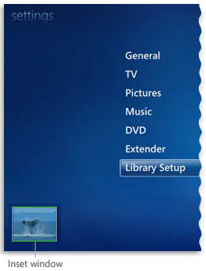

# "Your request couldn’t be completed. Please try again in a few minutes" error when Exchange 2013 Administrator can't manage Exchange 2019 databases in EAC

## Symptoms

Consider the following scenario:

- You are working in a Microsoft Exchange Server 2013 and Exchange Server 2019 coexistence organization.
- You are the Exchange administrator.
- Your mailbox is located on Exchange Server 2013.

In this scenario, you can't manage the Exchange Server 2019 databases by using the Exchange Admin Center (EAC). Also, you receive an error message that resembles the following:

```
"Your request couldn’t be completed. Please try again in a few minutes"
```

::: mmc.confidentiality: internal
## Cause




This is default behavior. It occurs because AddOrganizerToSubjectand DeleteSubjectare set to True.

To view these value for the Resource mailbox, run the one of the following cmdlets:

- For Exchange Server 2016,Exchange Server 2013 or Exchange Server 2010

    ```powershell
    Get-CalendarProcessing -Identity <RESOURCEMAILBOX> | FL
    ```    
- For Exchange Server 2007

    ```powrshell
    Get-MailboxCalendarSettings -identity <RESOURCEMAILBOX> |FL    
    ```
:::

## Resolution


To fix this issue, use either of the following methods:

- Use `https://<Exchange Server 2019>/ecp/?ExchClientVer=15.2` to access Exchange Server 2019 EAC, and then log on by using an Exchange Server 2013 administrator account.
- Move the administrator mailbox to Exchange Server 2019 so that it uses the `https://<Exchange 2019 Server>/ecp` address.
